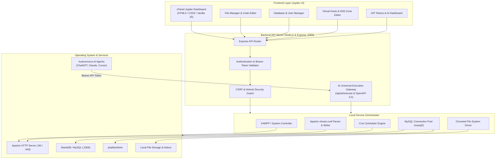

<div align="center">

# 🚀 cPanel-LocalHost

### Modern Web Hosting Control Panel for Localhost with Autonomous AI Integration & XAMPP Orchestration

[](https://github.com/shubhXlab/cPanel-LocalHost/releases/latest)
[](https://github.com/shubhXlab/cPanel-LocalHost/releases/latest)
[](LICENSE)
[](https://nodejs.org/)
[](https://cpanel.net)
[](http://localhost:2083/api/ai/openapi.json)

<br/>

[📦 **Download Latest Release**](https://github.com/shubhXlab/cPanel-LocalHost/releases/latest) • 
[📖 **Setup Guide (SETUP.md)**](SETUP.md) • 
[🤖 **AI Integration**](#-ai-agent-integration) • 
[🐛 **Report Bug**](https://github.com/shubhXlab/cPanel-LocalHost/issues)

---

</div>

## 📑 Table of Contents

- [🌟 Overview](#-overview)
- [⚡ Quick Start (One-Click Windows Setup)](#-quick-start-one-click-windows-setup)
- [💻 Developer Setup (Run from Source)](#-developer-setup-run-from-source)
- [💡 Core Modules & Features](#-core-modules--features)
- [🏗️ System Architecture](#️-system-architecture)
- [🤖 AI Agent Integration](#-ai-agent-integration)
- [📂 Directory Structure](#-directory-structure)
- [🧪 Verification & Testing](#-verification--testing)
- [🤝 Contributing](#-contributing)
- [📜 License](#-license)
- [👨‍💻 Author](#-author)

---

## 🌟 Overview

**cPanel-LocalHost** is a production-grade, browser-based web hosting control panel developed on a high-concurrency Node.js architecture. It faithfully replicates the authentic **cPanel Jupiter** theme while seamlessly orchestrating local services (Apache HTTP Server, MariaDB/MySQL, and MultiPHP).

Beyond traditional web hosting administration, **cPanel-LocalHost** pioneers a native **Autonomous AI Agent Execution Gateway** — allowing AI models (**ChatGPT Custom GPT Actions, Anthropic Claude, Cursor, and LangChain**) to inspect and manage server files, databases, virtual hosts, and cron jobs programmatically through secure Bearer API tokens, OpenAPI 3.0 specifications, and authentic cPanel UAPI protocols.

> [!TIP]
> **No cloud hosting fees required.** Develop, test, and automate WordPress sites, PHP apps, MySQL databases, and virtual hosts locally with the exact look, feel, and APIs of production cPanel.

---

## ⚡ Quick Start (One-Click Windows Setup)

The fastest and easiest way to use cPanel-LocalHost on any Windows 10/11 machine.

### 1. Download Package
Grab the latest release from the [**Releases Page**](https://github.com/shubhXlab/cPanel-LocalHost/releases/latest).

Ensure the following 3 files are in the same folder:
```text
📁 cPanel-LocalHost/
├── cPanel-Localhost.exe           ← Standalone executable (~132 MB)
├── scripts/
│   └── cpanel-localhost-cert.cer  ← SSL Trust Certificate
└── Install-and-Run.bat            ← One-click setup launcher
```

### 2. Double-Click `Install-and-Run.bat`
- **UAC Prompt**: Click **Yes** to allow administrator privileges.
- **Automated Setup**:
  1. Detects if the SSL certificate is already installed (skips if present).
  2. Installs the certificate into your Windows **Trusted Root Certification Authorities** store.
  3. Launches `cPanel-Localhost.exe`.
  4. Automatically opens **[http://localhost:2083](http://localhost:2083)** in your default browser.

> [!NOTE]
> For in-depth instructions, manual certificate management, and troubleshooting, read the complete [**SETUP.md**](SETUP.md) guide.

---

## 💻 Developer Setup (Run from Source)

If you want to modify the source code or contribute:

### Prerequisites
- [Node.js](https://nodejs.org/) v18.0.0 or higher
- [XAMPP](https://www.apachefriends.org/) (Apache + MariaDB/MySQL)
- [Git](https://git-scm.com/)

### Step-by-Step
```bash
# 1. Clone the repository
git clone https://github.com/shubhXlab/cPanel-LocalHost.git
cd cPanel-LocalHost

# 2. Install dependencies
npm install

# 3. Configure environment
copy .env.example .env

# 4. Start the control panel
npm start

# Or start with auto-reload (development mode)
npm run dev
```

Visit **[http://localhost:2083](http://localhost:2083)** (or fallback port `2082` if `2083` is occupied).

---

## 💡 Core Modules & Features

| Module | Icon | Description |
|---|:---:|---|
| **File Manager** | 📁 | Chroot jail directory escape protection, in-browser code editor, archive zip compression/extraction, upload, download, and file permissions. |
| **MySQL Databases** | 🗄️ | Connection pooling via `mysql2`, create/drop databases, user management, SQL privilege assignment, and one-click phpMyAdmin launch. |
| **Domains & VHosts** | 🌐 | Automated Apache `httpd-vhosts.conf` generation, local custom domain binding (`.local`, `.test`), and DNS Zone Editor (`A`, `CNAME`, `MX`, `TXT`). |
| **AI Agent Gateway** | 🤖 | Universal AI execution gateway (`/api/ai/execute`), OpenAPI 3.0 schemas (`/api/ai/openapi.json`), and SHA-256 Bearer API Tokens with granular scopes. |
| **Cron Job Scheduler** | ⏱️ | Standard 5-field Linux cron syntax (`* * * * *`), on-demand task trigger, and execution history capture. |
| **Security & SSL/TLS** | 🛡️ | SSL/TLS certificate installer, IP blocklist, Helmet security headers, CSRF tokens, and Two-Factor Authentication (TOTP / QR code). |
| **MultiPHP Manager** | ⚙️ | Switch PHP runtime versions, inspect installed modules, and edit `php.ini` directives directly from the browser. |
| **Server Metrics** | 📊 | Real-time CPU, RAM, disk space, active network connections, ICMP Ping diagnostics, and custom HTTP error pages (`.htaccess` synced). |

---

## 🏗️ System Architecture



---

## 🤖 AI Agent Integration

cPanel-LocalHost exposes a native AI Execution Gateway tailored for function-calling LLMs.

### 1. Generate an API Token
1. Open the cPanel dashboard at `http://localhost:2083`.
2. Navigate to **Security** &rarr; **Manage API Tokens** (`/api.html`).
3. Create a token with desired scopes (`files`, `mysql`, `domains`, etc.).
4. Copy the generated token (SHA-256 hashed on storage).

### 2. Connect Your Agent
- **OpenAPI Schema**: `http://localhost:2083/api/ai/openapi.json`
- **Universal Execution Endpoint**: `POST http://localhost:2083/api/ai/execute`
- **Auth Header**: `Authorization: Bearer <your_token>`

#### Example AI Tool Call:
```http
POST /api/ai/execute HTTP/1.1
Host: localhost:2083
Authorization: Bearer cphost_abc123...
Content-Type: application/json

{
  "module": "files",
  "action": "list",
  "params": {
    "dir": "/"
  }
}
```

#### Example Response:
```json
{
  "status": 1,
  "data": {
    "files": [
      { "name": "index.php", "type": "file", "size": 1024 },
      { "name": "wp-content", "type": "dir", "size": 0 }
    ]
  },
  "metadata": {
    "module": "files",
    "action": "list"
  }
}
```

---

## 📂 Directory Structure

```text
cpanel-localhost/
├── client/                     # Frontend client (cPanel Jupiter UI)
│   ├── assets/                 # Icons, branding, Ace editor bundles
│   ├── css/                    # Jupiter styles & theme variables
│   ├── js/                     # Modular client controllers & API connectors
│   ├── index.html              # Main cPanel Dashboard
│   ├── files.html              # File Manager UI
│   ├── editor.html             # Code Editor UI
│   ├── databases.html          # MySQL & Database User UI
│   ├── domains.html            # Virtual Hosts & Zone Editor UI
│   ├── advanced.html           # Cron Jobs & Error Pages UI
│   ├── security.html           # SSL/TLS & IP Blocker UI
│   ├── software.html           # MultiPHP & Package Manager UI
│   └── api.html                # API Tokens & AI Gateway UI
├── server/                     # Backend Node.js & Express application
│   ├── config/                 # Service & environment configuration
│   ├── database/               # MySQL pool & persistent JSON store
│   ├── middleware/             # Auth, CSRF, security headers, rate-limiting
│   ├── routes/                 # Modular RESTful & UAPI endpoints
│   ├── services/               # Background automation engines
│   ├── app.js                  # Express app setup & middleware pipeline
│   └── server.js               # Entrypoint & port listener (:2083)
├── launcher/                   # C# standalone single-file launcher & app manifest
├── scripts/                    # Automation, packaging, and certificate scripts
├── docs/                       # Architectural documentation & project reports
├── landing/                    # Distribution landing page assets
├── Install-and-Run.bat         # One-click Windows setup launcher
├── SETUP.md                    # Complete setup and troubleshooting guide
├── package.json                # Project dependencies and npm scripts
├── LICENSE                     # MIT Open Source License
└── README.md                   # Project documentation
```

---

## 🧪 Verification & Testing

Execute the automated end-to-end test suite:

```bash
# Start server in terminal 1
npm start

# Run verification suite in terminal 2
node test_cpanel_suite.js
```

---

## 🤝 Contributing

Contributions, issues, and feature requests are welcome!  
Feel free to check the [issues page](https://github.com/shubhXlab/cPanel-LocalHost/issues) and read the [CONTRIBUTING.md](CONTRIBUTING.md) guide.

1. Fork the Project
2. Create your Feature Branch (`git checkout -b feature/AmazingFeature`)
3. Commit your Changes (`git commit -m 'feat: add some AmazingFeature'`)
4. Push to the Branch (`git push origin feature/AmazingFeature`)
5. Open a Pull Request

---

## 📜 License

Distributed under the **MIT License**. See [LICENSE](LICENSE) for more details.

---

## 👨‍💻 Author

**Shubham Ramjiyani** ([@shubhXlab](https://github.com/shubhXlab))  
*Developer & Creator of cPanel-LocalHost*
